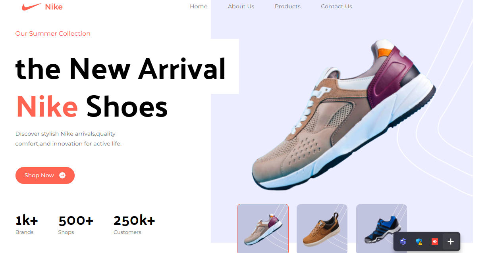

# Nike Landing Page Clone  

A modern and responsive landing page inspired by Nike, built using **React** and **Vite**.  

## 🚀 Features  

- **Fast & Lightweight** – Powered by Vite for blazing-fast development.  
- **Responsive Design** – Works seamlessly on all screen sizes.  
- **Reusable Components** – Modular and maintainable React components.  
- **Optimized Performance** – Uses lazy loading and optimized assets.  
- **Styled with Tailwind CSS** – Modern and clean UI.  

## 🛠 Tech Stack  

- **React.js** – Component-based UI development.  
- **Vite** – Next-gen frontend tooling.  
- **Tailwind CSS** – Utility-first styling.  

## 📦 Installation  

1. Clone the repository:  
   ```sh
   git clone https://github.com/sahilsha31/Nike-LP-Clone.git
   cd Nike-LP-Clone

2. Install dependencies:
   npm install

3. Start the development server:
    npm run dev

## Deployment
To build the project for production:

npm run build

## Preview

